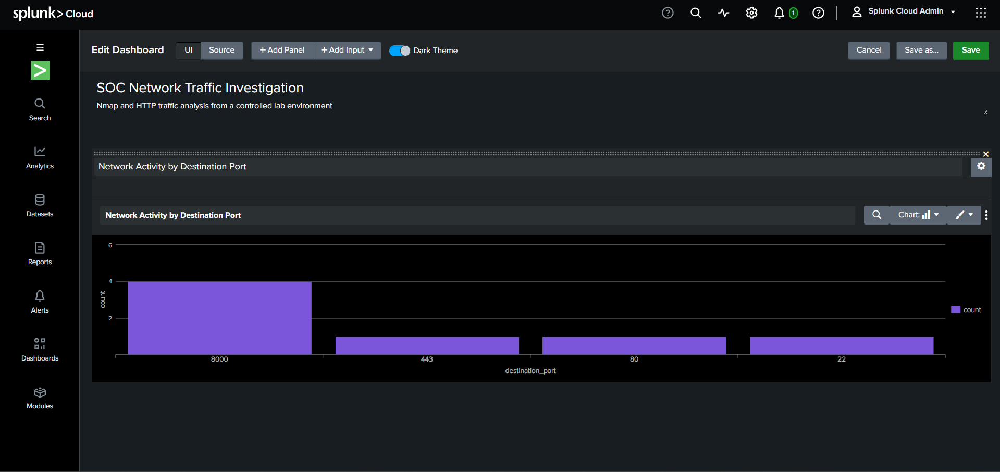
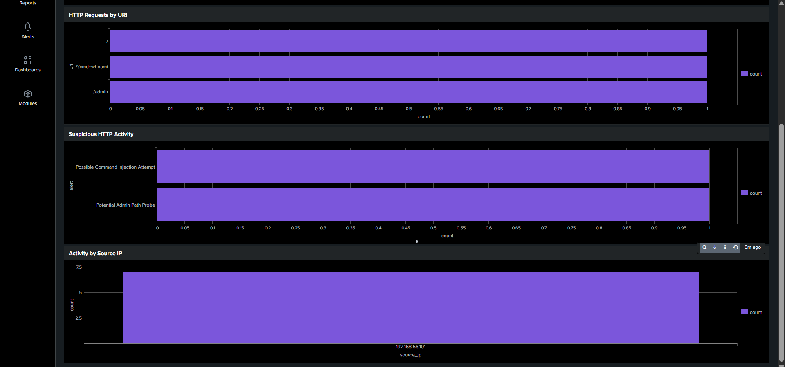

# SOC Network Traffic Investigation & Detection Lab

**A hands-on SOC investigation, from packet to dashboard.**

This project traces a simulated attack scenario through an actual analyst workflow: recon → packet capture → SIEM ingestion → detection logic → visualization. Everything was built and investigated in an isolated home lab, using core tools commonly encountered in SOC and network-security workflows.

📄 [**Full Project Report (PDF)**](SOC_Network_Traffic_Investigation_Report.pdf) — detailed write-up with screenshots and full analysis

---

## Why This Project

Reading about SIEM investigations and actually running one are different skills. I wanted to prove — to myself and on paper — that I could take raw network activity from zero, carry it through packet-level analysis, and turn it into searchable, alert-worthy SIEM data. This lab is that end-to-end loop, done once, done properly, and documented like a real investigation rather than a tutorial walkthrough.

---

## Lab Setup

| Component | Detail |
|---|---|
| Hypervisor | VirtualBox, host-only network |
| Attacker/Analyst machine | Kali Linux — `192.168.56.101` |
| Target machine | Ubuntu Linux — `192.168.56.102` |
| Simulated service | Python `http.server` on port `8000` |
| SIEM | Splunk Cloud |

Two VMs, one isolated network, no internet-facing exposure — everything stayed contained.

---

## Workflow

```
Nmap recon  ->  Wireshark packet capture  ->  HTTP traffic review
     ->  event export (CSV)  ->  Splunk Cloud ingestion
     ->  SPL detection logic  ->  dashboard visualization
```

**1. Reconnaissance (Nmap)**
Scanned the Ubuntu target from Kali to map the attack surface — which ports were live, which were closed.

**2. Packet Analysis (Wireshark)**
Captured the resulting traffic to confirm what Nmap reported at the packet level — TCP handshakes on the open port, RSTs on the closed ones — then followed the HTTP streams once real requests started hitting the server.

**3. HTTP Traffic Review**
With the service confirmed on port 8000, generated and inspected three requests of increasing interest: a normal root request, a probe against `/admin`, and a request carrying a `cmd` parameter (`/?cmd=whoami`).

**4. Splunk Ingestion**
Exported the captured activity as structured CSV events (source/dest IP, port, protocol, URI, result) and uploaded it into Splunk Cloud — 7 events total.

**5. Detection Engineering (SPL)**
Wrote two SPL searches to flag the suspicious URIs automatically instead of eyeballing the event list.

**6. Dashboard**
Built a 4-panel Splunk dashboard summarizing the investigation at a glance.

---

## Findings

| Port | State |
|---|---|
| 22/tcp | Closed |
| 80/tcp | Closed |
| 443/tcp | Closed |
| **8000/tcp** | **Open — HTTP service** |

Port 8000 was the only live service, hosting the Python HTTP server used for the rest of the investigation.

**Requests observed against it:**

| Request | Classification |
|---|---|
| `GET /` | Normal |
| `GET /admin` | Potential Admin Path Probe |
| `GET /?cmd=whoami` | Possible Command Injection Attempt |

> **On the `/?cmd=whoami` request specifically:** the `cmd` parameter is a legitimate red flag worth flagging and investigating — but its presence alone doesn't prove anything executed. Nothing in the packet capture confirmed the command actually ran on the Ubuntu host. This project treats it strictly as an **indicator worth investigating**, not a confirmed compromise — that distinction is the whole point of triage.

---

## Detection Logic

Two SPL searches, both scoped to the ingested CSV source.

**Command-injection indicator:**

```spl
source="network_events v2.csv" sourcetype="csv"
| where like(uri,"%cmd%")
| eval alert="Possible Command Injection Attempt"
| table source_ip destination_ip destination_port uri alert
```

**Combined admin-probe + command-injection detection:**

```spl
source="network_events v2.csv" sourcetype="csv"
| where like(uri,"%cmd%") OR like(uri,"%admin%")
| eval alert=case(
    like(uri,"%cmd%"),"Possible Command Injection Attempt",
    like(uri,"%admin%"),"Potential Admin Path Probe"
)
| table source_ip destination_ip destination_port uri alert
```

The second query is the one that matters — it turns two different "interesting" URI patterns into a single, labeled, triage-ready table instead of two separate manual searches.

---

## Dashboard

Four panels, built to answer the questions a SOC analyst actually asks first:

- **Network activity by destination port** — where is the traffic actually going?
- **HTTP requests by URI** — what's being requested?
- **Suspicious HTTP activity** — which of those requests tripped a detection?
- **Activity by source IP** — who's generating it?




---

## Evidence

```
evidence/
├── splunk-command-event.png
├── splunk-command-injection-detection.png
├── splunk-admin-command-detection.png
├── splunk-dashboard-1.png
└── splunk-dashboards-2-4.png
```

---

## Skills Demonstrated

`Network Reconnaissance` · `TCP/IP Analysis` · `Packet Capture & Filtering (Wireshark)` · `HTTP Traffic Analysis` · `SIEM Log Ingestion` · `SPL Query Writing` · `Detection Engineering` · `Security Event Correlation` · `SOC Dashboarding` · `Evidence-Based Investigation Documentation`

---

## Scope & Limitations

This is a controlled home-lab exercise, not a production SOC dataset — worth being upfront about:

- 7 total events, manually structured into CSV rather than pulled from a live log pipeline
- Detections are demonstration-level (URI substring matching), not tuned for production noise levels
- Command execution for `/?cmd=whoami` was **not** confirmed — flagged as a suspicious indicator only

The value here isn't the scale of the data — it's the complete, correct workflow: capture evidence, correlate it, detect on it, visualize it, and report the findings honestly, including what *wasn't* proven.

---

*Performed entirely within an isolated VirtualBox lab for educational and defensive security purposes.*
